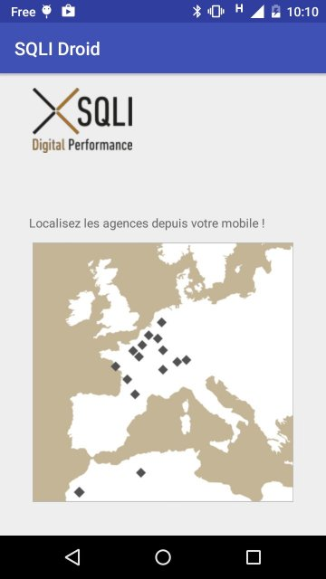
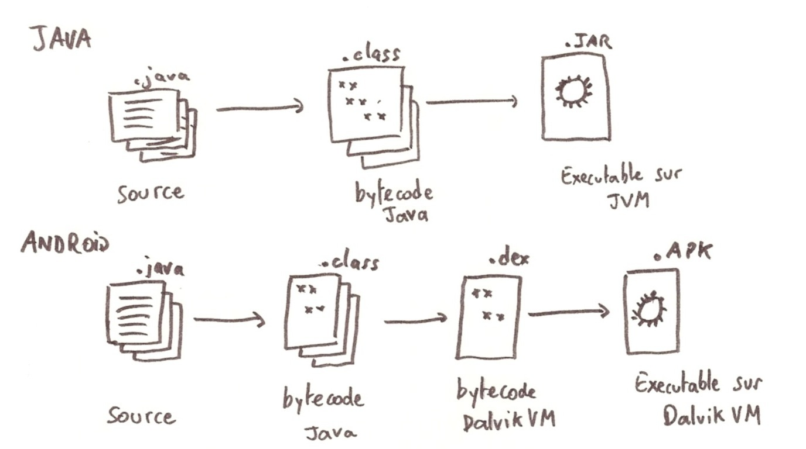
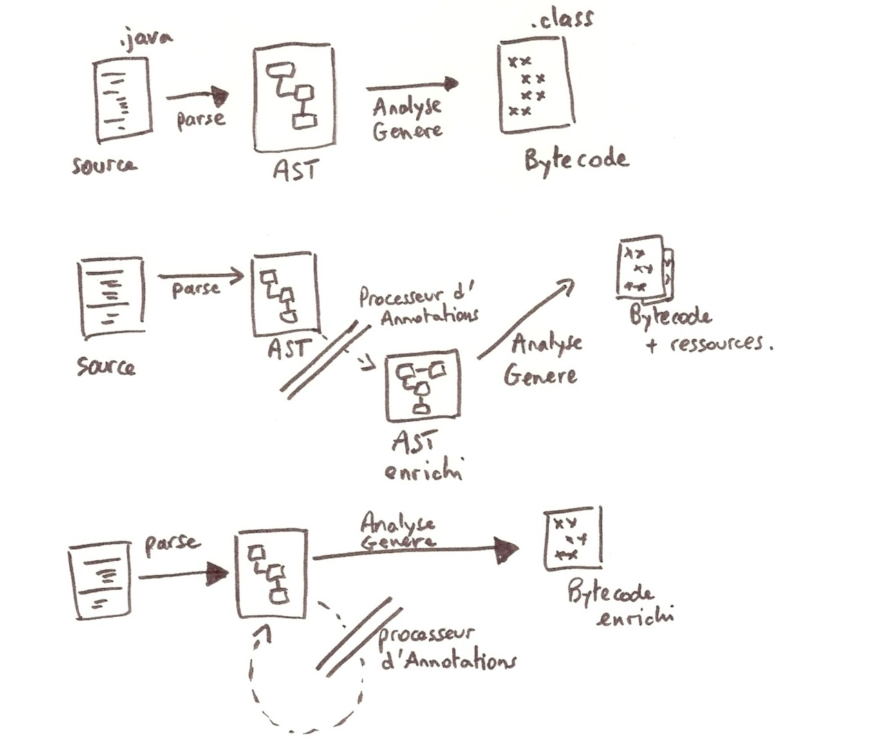

# SQLIDroid Agencies with Android Annotations

A fork of aBasic Android app rewritten to use Android Annotations and Lombok.

Forked from [this repository](https://github.com/sqli-nantes/sqlidroid-agencies).

It display all SQLI agencies.
It's composed of 3 screens : A main screen, a List view showing all available agencies, and a screen detailing a specific agency.




# Using Android Annotations

Android Annotations simplifies the code by using annotations `@`.

**1 rule** to know :
 * bytecode for each class annotated by Android Annotations stays intact ! A subclass is generated and creates a new class suffixed by `_`.

**2 corollaries** to this rule :
 * All references to activities should be made to the underscored class. For instance, `MyActivity` will now be referenced as `MyActivity_` in the manifest or when using new Intents.
 * Attributes and functions annotated must be `protected` (and not `private` anymore).

**Some annotations :**

  * `@EActivity(R.activity.main)` inflate le layout dans l'Activity
  * `@ViewById(R.id.viewId)` binde le composant viewId
  * `@Click(R.id.viewId)` action du clic du viewId
  * `@EBean` pour instancier un Bean et `@Bean` pour injecter un bean

More information on the [official website](http://androidannotations.org/).

# Using Lombok

Lombok simplifies the Java code by generating extra bytecode during the APT processing.

for instance :
 * `@Getter` on an attribute adds its Getter
 * `@Getter` on a class adds getters for all attributes of the class
 * `@Data` on a class adds getters/setters, `toString()`, `hashCode()`, `equals()`


Gradle must have the following dependencies:

```
provided "org.projectlombok:lombok:1.12.6"
	apt "org.projectlombok:lombok:1.12.6"
```

More informations on [Lombok website](https://projectlombok.org) and its integation on Android at [Lombok setup for Android](https://projectlombok.org/setup/android.html).

# How APT works for Android
A picture is worth a thousand words.




